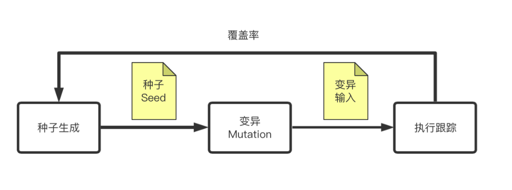

# 模糊测试介绍
什么是模糊测试技术呢，就是用大量的随机输入去测试软件的健壮性等，最早是软件测试的概念。后来出现了afl，便出现了以覆盖率为导向的模糊测试技术。  

## AFL
  
看图可以很好的理解，最开始给afl初始种子，然后经过变异得到输入，将输入给到待测试程序，并通过插桩技术对程序跟踪，或者覆盖率，个人认为现在这个覆盖率已经变成了一个大的概念，可以是块覆盖、可以是边覆盖、可以是很多其他有利于程序输入的信息，只要是有利于变异和种子筛选的都可以算，然后覆盖率指导之前的流程，周而复始，直到遇到崩溃情况，便将其保存。
这种覆盖率的想法使得输入不再是随机盲目的，可以说afl的出现使得模糊测试进入了新的阶段，虽然afl在2.52b版本之后就停止更新了，但是Google目前还一直维护着，而且后来出现了很多分支。今天用到的模糊测试工具就是AFL，其实其他工具使用思路也大同小异，都可以借鉴。  

## 挑选合适的Fuzzer  
这一步我单独写一个章节是因为这里很重要，虽然说我们一直讨论的是用AFL相关，但是实际上在此基础上有很多很多的分支，我才疏学浅，这里就列一小部分（有兴趣可以找这三四年顶会的综述论文看一下，一定会有收获的）  
  
关于AFL的分支，我这里分为四类（并不一定是afl转来了，但一定是受其思想影响的进步）：  
#### 移植
1.afl多是用在Linux的c语言类程序文件模糊测试，所以就有人做了平台移植：最经典的就是winafl，在Windows平台下的模糊测试工具；  
2.还有针对语言的移植，比如针对rust语言的/afl.rs、针对python语言的python-afl、针对Java语言的java-afl、针对C#语言的sharpfuzz；  
#### 性能的改进
1.这部分是指速度性能的改进，既有针对有源码的libfuzzer，通过用llvm、clang框架大大提升了性能，这部分Google自家的fuzzer做的算是很好了，还有honggfuzz，都是对afl的很大改进；
2.也有针对无源码的，像Qemu、PIN、Dyninst这些工具的引入，尽管说afl自带的系统里有qemu等但是效率不理想，所以就有一些别的大牛单独做的新的分支，甚至还有跟Frida结合的应用；  
#### 提升效率
这部分每年都会看见论文的新花样，针对变异策略的、针对种子筛选的层出不穷，afl-smart、ijon等等，不管是加入符号执行还是对策略改进，实际上对afl给改动并不大。主要还是从理论上进行了设想，提出了新思路；  
#### 重构
1.基本上跟原来对afl差别很大了，一种是对整个变异策略全部重建，比如Angora就是用rust语言重新写对，并且用了自己新对变异策略；  
2.另一种是加入新元素，比如Neuzz这个就是加入了机器学习，再比如今年出现了一些对蓝牙的、对use设备对模糊测试；  
总结下来就是一二类属于实际应用类，比较注重运用，怎么用的舒服，用得快怎么来，三四类属于理论类，比较注意想法。这篇文章的fuzz目标是文件类型的，而且是个小库，就用afl就够了，算是抛砖引玉了。  

## 使用
AFL使用流程：https://www.cnblogs.com/wayne-tao/p/11739420.html  

